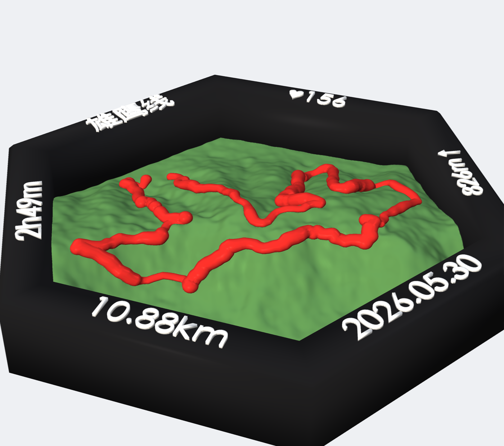
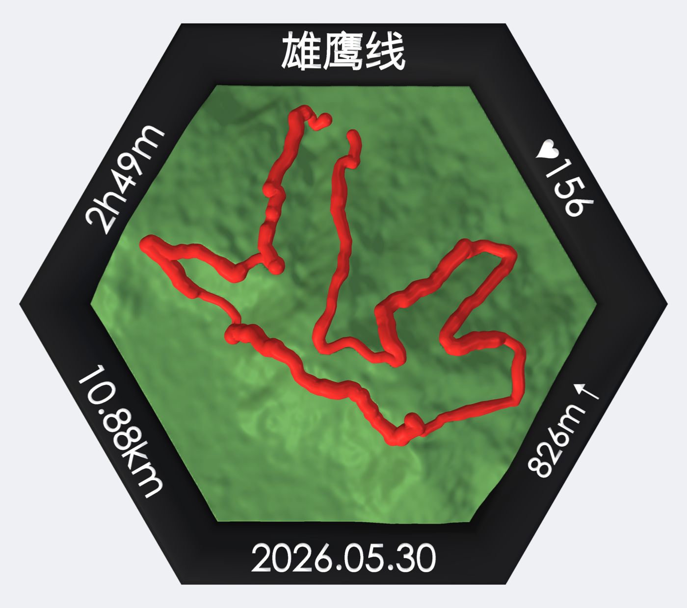
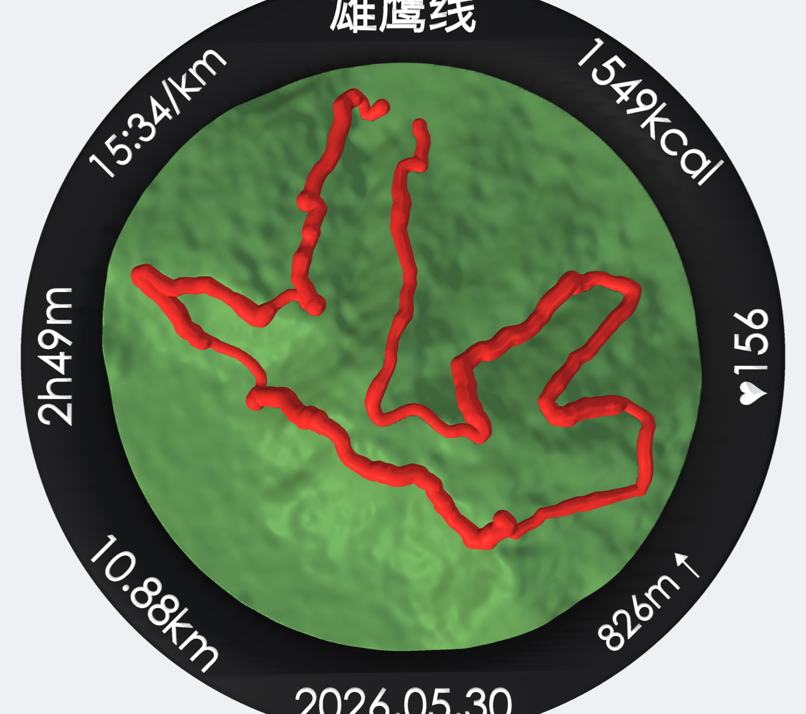
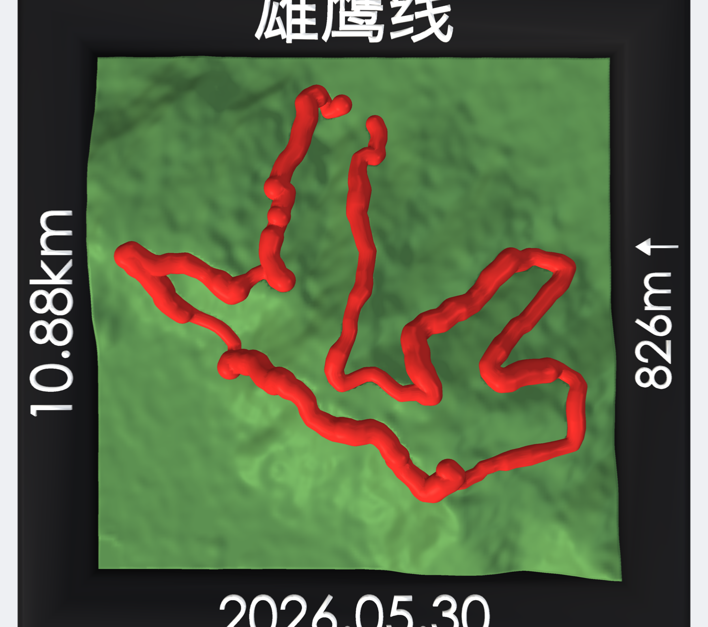
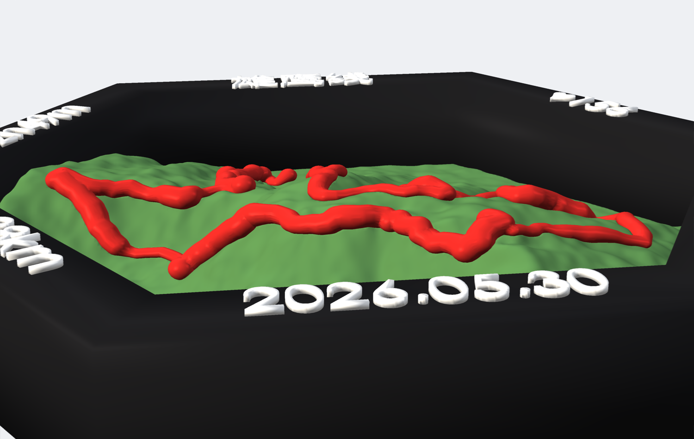

# fitscape

**把一份 Garmin/FIT 运动记录变成一块可直接 3D 打印的纪念牌。**
Turn any Garmin `.fit` activity into a 3D-printable keepsake — your GPS route as a raised ridge,
auto-labelled stats, a swappable frame shape, and **two base styles**: a **terrain relief** for
hilly runs/hikes, or a **city-map plate** (OSM roads + landmarks) for flat rides. Outputs
print-ready `.3mf` / `.stl` for Bambu Studio & friends.

<p align="center">
  
  
</p>

> 往 `resources/` 扔一个 `.fit`，跑一行命令，就在 `output/<名字>/` 得到**隔离、完整、可打印**的产物：
> `*.3mf`（部件已对齐分色）、`.glb`、`stl/`、渲染图、`stats.json`、`config_used.yaml`、专属打印说明。

---

## ✨ 能做什么

- 🗺️ **真实地形浮雕**（适合越野/徒步）：按路线坐标抓全球高程（AWS Terrarium，无需 key，WGS-84 与 GPS 同基准），生成等高浮雕。
- 🧭 **城市地图底座**（适合平路骑行）：地形几乎是平的时，改用 **OpenStreetMap 路网**做底图，路线浮在街道之上。
- 🟥 **路线即故事**：GPS 轨迹做成凸起的「线脊」。两种样式——`bead`（贴地圆脊，越慢越高越粗）/ `ribbon`（竖直墙，高度=速度，平路骑行的「速度天际线」）。
- 🏙️ **图标与地标**：起点旗、终点星、城市「起伏的小楼」天际线、地标塔（如机场）等 10 种图标，按真实经纬度摆放。
- 🏷️ **成绩自动标注**：距离/爬升/日期/用时/配速/心率/卡路里… 从 FIT 自动算出并模板化布局；**骑行自动用均速代替配速**。
- 📍 **地名点缀**：把途经的行政区/地标（高德反查）刻在底座上，平淡的底图变成「旅程地图」。
- ⬡ **边框可换形状**：六边形/方形/菱形/三角/五边/八边/圆形，路线用线性规划自动收进盘内不出界。
- 🧩 **多色实体已分离**：各部件互不重叠（布尔挖空），多色打印颜色干净；也可单色。
- ✅ **几何保证水密**：全部布尔走 `manifold3d`，导出 STL/3MF 重载均水密，可直接切片。

## 🖼️ 示例（同一条越野跑，换不同边框）

| 六边形 hexagon | 圆形 circle | 方形 square |
|:---:|:---:|:---:|
|  |  |  |

<p align="center"><br/>
<sub>低角度可见：红色线脊随快慢起伏——爬坡的艰难「立」在线上。</sub></p>

可打印示例文件：[`docs/sample/xiongying-hexagon.3mf`](docs/sample/xiongying-hexagon.3mf)（直接拖进 Bambu Studio）。

## 🚀 快速开始

```bash
pip install -r requirements.txt          # macOS 自带中日韩字体；其它系统见下方“字体”

# 把 .fit 放进 resources/，然后：
python make.py 600371130_ACTIVITY.fit --title 雄鹰线        # 默认：地形浮雕·六边形
python make.py 600371130_ACTIVITY.fit --shape circle --title 雄鹰线
python make.py --all                                        # 批量处理 resources/ 下所有 fit

# 平路骑行 → 城市地图底座（OSM 路网 + 速度线脊 + 图标）
python make.py your-ride.fit --preset cycling_map  --title 百公里骑行
```

仓库自带越野跑示例 `resources/600371130_ACTIVITY.fit`，开箱即可复现上图。
（你自己的 `.fit` 放进 `resources/` 即可；个人活动文件默认不入库，见 `.gitignore`。）

### 命令行
| 参数 | 说明 |
|---|---|
| `fit` / `--all` | FIT 文件名或路径（在 `resources/` 里找）/ 批量处理全部 |
| `--shape` | `hexagon`/`hexagon_pointy`/`square`/`diamond`/`triangle`/`pentagon`/`octagon`/`circle` |
| `--title` | 顶部标题（缺省=运动类型，如「越野跑」「骑行」） |
| `--preset` | `presets/` 里的样式（见下） |
| `--config` | 单次活动的 YAML 覆盖（标注、图标、地名等） |
| `--exaggeration` | 垂直放大倍率 |
| `--out` / `--no-render` | 自定义输出目录 / 跳过渲染 |

配置叠加顺序：内置默认 → `--preset` → `--config` → 命令行参数。

### 内置预设 `presets/`
| 预设 | 说明 |
|---|---|
| `hexagon_classic` | 经典地形浮雕六边形（默认风格） |
| `circle_medal` / `square_modern` / `octagon` | 换形状的地形浮雕 |
| `cycling_ribbon` | 平路骑行：保留地形但路线用竖直「速度线脊」 |
| `cycling_map` | 平路骑行：**城市地图底座**（深蓝底 + OSM 路网 + 速度线脊 + 金色图标） |

## 🧭 两种底座 · `terrain_style`

- **`relief`（默认）** — 真实地形浮雕，适合有起伏的越野/徒步。路线建议 `route_style: bead`。
- **`flat`** — 平整地图底座（不抓地形），适合平路骑行。配 `roads_enabled: true` 画 OSM 路网、
  `route_style: ribbon` 让路线变成「速度天际线」、再用图标/地名点缀。

## 🟥 路线样式 · `route_style`
- **`bead`** — 贴着地形的圆脊；`route_metric`(`speed`/`hr`/`grade`) 调制：越慢/越陡越高越粗。
  键：`route_w_fast/slow` `route_h_fast/slow` `route_embed` `route_encode`(`height`/`uniform`) `route_invert`。
- **`ribbon`** — 竖直墙，高度编码一个指标（平路骑行用）。键：`ribbon_metric`(`speed`/`hr`/`grade`/`elevation`，
  高=值大)、`ribbon_thick` `ribbon_h_min/max` `ribbon_embed`。

## 🏙️ 路网 · 图标 · 地名（地图底座点缀）

```yaml
# 在 --config 的 YAML 里：
roads_enabled: true                 # OSM 主干道（motorway/trunk/primary…）
icons:                              # 真实经纬度摆放；type 见下
  - {type: flag, lat: 39.731, lon: 116.491, size: 6, height: 7}   # 起点
  - {type: star, lat: 39.016, lon: 116.138, size: 7, height: 3.4} # 终点
  - {type: tower, lat: 39.508, lon: 116.405, size: 4.4, height: 8.5}  # 地标
  - {type: skyline, lat: 39.62, lon: 116.34, dx: -27, dy: -5, size: 7.5, height: 4.6}
decorations:                       # 地名/地标文字，刻在底座
  - {text: 大兴区, lat: 39.62, lon: 116.34, dx: -27}
```
- **图标类型**：`dot ring star diamond triangle flag bar building tower skyline`（`skyline`=起伏的小楼簇）。
  键：`color_icon` `icon_size` `icon_height`。
- **路网键**：`road_classes` `road_w_mm` `road_raise` `road_res` `road_corridor_km`(>0 只保留路线两侧走廊) `color_roads`。
- **地名键**：`decoration_h` `decoration_raise` `decoration_embed` `color_decoration`。
- 经纬度用 **WGS-84**；高德反查出的 GCJ-02 坐标需先转换（见 `activity` 注释）。

## 🏷️ 标注系统（模板化、自动布局）

不写 `labels` 时按形状插槽 + 成绩**自动布局**（骑行优先 `{speed_kmh}`，否则 `{pace}`）；要自定义：

```yaml
labels:
  - {slot: top,    content: "{title}", size: title, rot: upright}
  - {slot: bottom, content: "{date}"}
  - {slot: ll,     content: "{distance}"}
  - {slot: lr,     content: "{ascent_arrow}"}
```
`content` 可混排占位符与文字（`"D+{ascent}"`、`"♥{hr}"`、`"{date_cn}"`）。过长自动缩放。
**占位符**：`{distance}` `{distance_full}` `{distance_mi}` `{ascent}` `{ascent_arrow}` `{descent}`
`{date}` `{date_dash}` `{date_cn}` `{duration}` `{duration_hms}` `{pace}` `{hr}` `{hr_heart}`
`{maxhr}` `{maxhr_heart}` `{calories}` `{kcal}` `{speed_kmh}` `{elev_max}` `{sport}`。

## ⚙️ 主要可配置项（`fitscape/config.py`，YAML 全可覆盖）

- **外形**：`shape` `across_mm` `frame_width` `frame_chamfer` `frame_rim_margin`
- **底座**：`terrain_style`(`relief`/`flat`) `base_h` `exaggeration` `color_base`
- **地形/DEM**：`grid_spacing` `dem_smooth_px` `dem_zoom`（长活动自动降级防爆内存）`route_safe_mm`
- **路线**：`route_style` 及上面的 bead/ribbon 键
- **路网/图标/地名**：见上一节
- **文字**：`h_title` `h_stat` `text_raise` `text_ring_frac` `embolden_title` `font_title` `font_stat`
- **配色**：`color_terrain` `color_route` `color_frame` `color_text`（RGBA 0–255）
- **其他**：`utc_offset_hours`（缺省按经度估算时区）

## 🖨️ 打印（拓竹 Bambu Studio）

拖入 `<stem>.3mf` → 部件已对齐 → 按部件分配滤料 → 平躺、底面贴板、**无需支撑**（高度场无真实悬垂）→
层高 0.16 mm、填充 10–15%。也可单色：只用 `stl/terrain.stl`（已含路线凹槽）。每个产物目录都有专属 `README.md`。

## 🧱 架构（`fitscape/`）

| 模块 | 职责 |
|---|---|
| `activity.py` | 解析 FIT → 轨迹 + 成绩模板串 |
| `dem.py` | AWS Terrarium 高程瓦片抓取/采样/去噪（自动选缩放） |
| `osm.py` | OpenStreetMap 路网抓取（Overpass，按等级），用于地图底座 |
| `shapes.py` | 形状抽象：轮廓 / 棱柱 / 倒角 / 标注插槽 / 路线内接拟合 |
| `projector.py` | 经纬度 ↔ 模型(mm)，按形状把路线收进盘内 |
| `text3d.py` | 文字（含 CJK）→ 水密实体；密集字加粗 |
| `builders.py` | 地形/底座 · 路线(bead/ribbon) · 路网 · 图标 · 边框 · 文字 各实体 |
| `geom.py` | manifold3d ↔ trimesh、布尔、高度场实体 |
| `render.py` · `pipeline.py` · `config.py` | 渲染 / 串联 / 配置·自动标注 |

## 🔤 字体

CJK 默认用 macOS 的 `Hiragino Sans GB` / `STHeiti`。其它系统在 `fitscape/text3d.py` 的 `FONTS`
里换本机字体路径（如思源黑体），或在 config 用 `font_title` / `font_stat` 指定。

## 🙏 数据来源

- 高程：**AWS Terrain Tiles**（Terrarium，公共数据集）
- 路网：**© OpenStreetMap contributors**（ODbL，经 Overpass API 获取）
- 地名/POI：**高德地图 (AMap)** 反查（可选）

## 📄 License

[MIT](LICENSE) © hx-w · 示例数据 `resources/600371130_ACTIVITY.fit` 为作者本人在苏州「雄鹰线」的一次越野跑记录。
